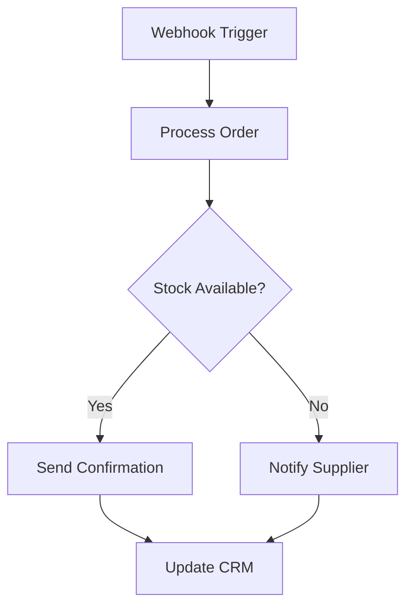

## Overview

Nordbrains delivers seamless integrations for your Shopify store, connecting it to third-party systems like ERPs, CRMs, and payment gateways. You get custom solutions that scale with your business, from theme customizations to advanced API workflows. Focus on your e-commerce growth while we handle the technical complexity.

<Callout kind="info">
  All integrations follow Shopify's best practices for security and performance.
</Callout>

## Shopify Theme and App Integrations

Enhance your store with custom themes and apps. Nordbrains builds Liquid-based themes that integrate apps like Klaviyo for email marketing or ReCharge for subscriptions.

<Columns cols={2}>
  <Card title="Theme Customization" icon="palette" href="#theme-customization">
    Modify sections, add dynamic content, and optimize for speed.
  </Card>
  <Card title="App Integration" icon="package" href="#app-integration">
    Embed third-party apps into your checkout and product pages.
  </Card>
</Columns>

### Implementing Theme Changes

Follow these steps to integrate a custom app into your theme.

<Steps>
  <Step title="Access Theme Editor" icon="edit-3">
    Log in to your Shopify admin and navigate to Online Store > Themes.
  </Step>
  <Step title="Edit Liquid Files" icon="code">
    Open `sections/product.liquid` and add the app script tag.
  </Step>
  <Step title="Test Integration" icon="play">
    Preview changes and verify app functionality.
  </Step>
</Steps>

## API Connections for E-Commerce

Connect Shopify to external APIs for inventory sync, order fulfillment, and customer data. Nordbrains uses webhooks and REST APIs to ensure real-time updates.

<ParamField path="orders" param-type="object" required="true">
  Sync new orders to your ERP system.
</ParamField>

<ParamField header="X-Shopify-Access-Token" param-type="string" required="true">
  Your private app token: `shpat_YOUR_TOKEN_HERE`.
</ParamField>

### Multi-Language API Example

<CodeGroup tabs="Node.js,Python">
  ````javascript
  const axios = require('axios');

  async function syncOrder(shop, token, orderId) {
    const response = await axios.get(
      `https://YOUR_SHOP.myshopify.com/admin/api/2024-01/orders/${orderId}.json`,
      {
        headers: {
          'X-Shopify-Access-Token': token
        }
      }
    );
    console.log(response.data.order);
  }
  ````

  ````python
  import requests

  def sync_order(shop, token, order_id):
      url = f"https://{shop}/admin/api/2024-01/orders/{order_id}.json"
      headers = {"X-Shopify-Access-Token": token}
      response = requests.get(url, headers=headers)
      print(response.json()["order"])
  ````
</CodeGroup>

## Custom Workflows and Automation

Build automated workflows like abandoned cart recovery or stock alerts. Nordbrains creates Zapier-like automations using Shopify Flow and custom scripts.



<Tabs>
  <Tab title="Webhook Setup" icon="zap">
    Configure webhooks in Shopify admin for `orders/create`.

    <Request tabs="cURL" show-lines="true">
    ````bash
    curl -X POST https://api.example.com/webhooks/orders \
      -H "Content-Type: application/json" \
      -d '{"order_id": 12345}'
    ````
    </Request>
  </Tab>
  <Tab title="Automation Script" icon="play-circle">
    Use Node.js to handle incoming webhooks.
  </Tab>
</Tabs>

## Best Practices for Scalable Integrations

Follow these guidelines to ensure your integrations perform under high traffic.

| Practice | Description | Benefit |
|----------|-------------|---------|
| Use GraphQL | Prefer over REST for complex queries | Reduces bandwidth by `<50%` |
| Rate Limiting | Implement retries with exponential backoff | Prevents API throttling |
| Idempotency Keys | Add unique keys to requests | Handles duplicates safely |
| Monitoring | Log all API calls | Quick issue detection |

<Expandable title="Advanced Scaling Tips" default-open="false">

Scale with Shopify's Bulk Operations API for importing thousands of products.

<Callout kind="tip">
  Monitor webhook delivery rates in Shopify admin.
</Callout>

</Expandable>

Integrate confidently with Nordbrains—contact us for a custom audit of your setup.